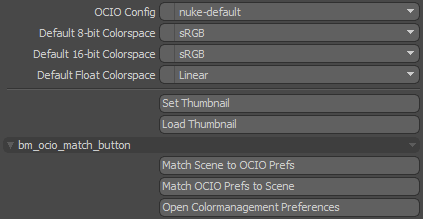

# bm_ocio_control
This kit for Modo bundles handy functions that help when working with different OCIO configs.

## General
### Scene Open Warning
When opening a scene that uses a different OCIO config and settings than current Preferences a dialog shown asking to match the Preferences to the current scene settings.

### FX item Scene Properties extension
The FX item displays the OCIO settings for the current scene. This kit adds two buttons.

## Installation
Copy to a kit folder within Modo's User Kits folder (or any other Modo import directory)

Windows: %APPDATA%/Luxology/Kits

Once setup the path to index.cfg should be %APPDATA%/Luxology/Kits/bm_ocio_control/index.cfg